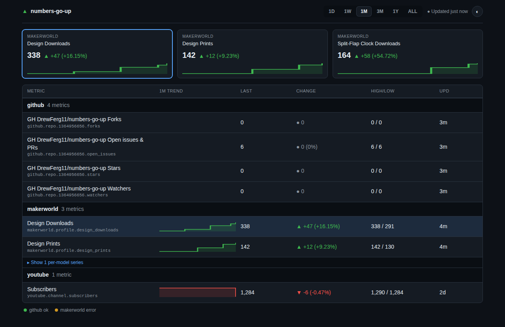

# numbers-go-up

Self-hosted, plugin-based tracker for the counters you care about — with
history, rate-of-change, a REST API, and Home Assistant integration.

> **Status: early.** Phase 0 (scaffold + container) is landing. There's no
> plugin, storage, or dashboard yet — just a service that builds, runs, and
> answers `/health`. This README will grow into real setup instructions as the
> phases land.

## The idea

Counters you care about live scattered across a dozen sites, each of which
shows you a number today and no memory of what it was last month. This runs on
your own hardware, checks those numbers on a schedule, and keeps the history —
so you can ask what changed, how fast, and since when.

- **One container.** FastAPI + APScheduler + SQLite. No time-series database,
  no Grafana, no message broker to babysit.
- **Plugins are the extension point.** A source is one Python file. Drop it in
  a folder and it gets scheduled.
- **Small on disk.** The storage layer records a sample only when a value
  actually changes, with a daily heartbeat so gaps stay meaningful. Measured at
  roughly 0.4 MB per year for twenty series.
- **Your data stays yours.** It's a file on your disk. Back it up by copying it.
- **Home Assistant native.** MQTT discovery creates the entities for you, with
  the right `state_class`, so you get real long-term statistics without writing
  YAML.

## Planned sources

| Source | Status |
|---|---|
| MakerWorld | Shipped |
| GitHub | Shipped |
| YouTube | Shipped |
| TikTok | Planned |
| Anything else | Write a plugin — that's the point |

**Every plugin is opt-in and inert by default.** A fresh install makes zero
outbound requests to any platform until you configure one. There are no default
user IDs or handles baked into the image.

## Running it

Everything persistent lives outside the image — the container itself is
disposable.

```sh
mkdir -p data config user-plugins
docker compose up -d
curl localhost:8080/health
```

No `chown` step needed: the container starts as root, matches `./data` and
`./config` to your host UID/GID (`PUID`/`PGID`, both default `1000`), then
drops to that user before running anything. See "File ownership (PUID/PGID)"
below for NAS setups where your user isn't 1000.

`/health` only says the process is up. To be alerted when a source stops
polling, point an uptime monitor (e.g. Uptime Kuma, HTTP type) at
`/health/plugins`. It returns 503 when an enabled plugin is blocked (HTTP 403)
or has failed 3 polls in a row. Tune that with `?failures=N`.

Logs go to the container's stderr. A failing plugin logs one warning when it
starts failing and one line when it recovers, not one per poll. Set
`NGU_LOG_LEVEL=DEBUG` to see every repeat.

Docker also knows when the app is unhealthy: the image ships a `HEALTHCHECK`
against `/health`, so `docker ps`, `docker inspect`, and Portainer all show a
`healthy`/`unhealthy` status without any extra config.

- `./data` — the SQLite DB and migration backups. **Must be local disk, never
  an NFS/SMB share** — SQLite's WAL locking is unreliable over network
  filesystems. The container refuses to start if it detects `./data` is on
  one; see "Network filesystems" below.
- `./config` — drop a `config.yaml` here (see
  [`config.yaml.example`](config.yaml.example)). If it's missing, the service
  writes a commented example next to where it looked and starts with defaults
  and zero plugins enabled.
- `./user-plugins` — optional plugins of your own. Named `user-plugins` on the
  host (not `plugins`, which is the repo's own built-in-plugin source
  directory) so a bind mount from a clone doesn't shadow the built-ins.

`docker rm` the container any time — none of the above lives inside it.

### File ownership (PUID/PGID)

NAS distros rarely use UID 1000 for the first user — Synology's is usually
1026, Unraid uses `99:100`. Set `PUID`/`PGID` in `docker-compose.yml` to match
whoever should own `./data` and `./config` on the host:

```yaml
environment:
  - PUID=1026
  - PGID=100
```

On startup, if the container is running as root (the default — no `user:` in
compose), the entrypoint `chown`s `./data` and `./config` to `PUID:PGID` (only
when the top-level owner doesn't already match, so this is a no-op on every
boot after the first) and then drops privileges to that user before running
anything. `PUID=0`/`PGID=0` are refused outright — the app never runs as
root.

Already setting `user: "1000:1000"` in compose? Nothing changes — the
entrypoint detects it's already non-root and skips straight to running the
app. Existing deployments keep working unchanged.

### Hardened runtime

For a locked-down compose config, add:

```yaml
read_only: true
tmpfs: [/tmp]
security_opt: ["no-new-privileges:true"]
cap_drop: [ALL]
```

With `user: "1000:1000"` set (non-root mode), all four work as-is. In
PUID/PGID mode (started as root, the default), the entrypoint needs to
`chown` and switch users, so use this instead:

```yaml
read_only: true
tmpfs: [/tmp]
cap_drop: [ALL]
cap_add: [CHOWN, SETUID, SETGID]
# no security_opt: no-new-privileges would block setpriv from switching users.
```

Either way, nothing the app writes lives outside `/data`, `/config`, and
`/tmp`.

### Network filesystems

`./data` holds the SQLite database, and SQLite's WAL locking is unreliable
over NFS/SMB — the one deployment mistake that can silently corrupt it. At
startup the container inspects `./data`'s mount and refuses to start with a
clear error if it's `nfs`, `nfs4`, `cifs`, `smb3`, `smbfs`, `fuse.sshfs`, or
`9p`. If you understand the risk and want to proceed anyway, set
`NGU_ALLOW_NETWORK_FS=1` — it still logs a WARNING on every start.

### Log rotation

`docker-compose.yml` already sets:

```yaml
logging:
  driver: json-file
  options: { max-size: "10m", max-file: "3" }
```

Equivalent flags for a bare `docker run`:

```sh
docker run --log-driver json-file --log-opt max-size=10m --log-opt max-file=3 ...
```

Portainer stacks honor the compose `logging:` block directly. The app only
ever logs to stdout/stderr — there are no log files inside the container to
worry about.

### Where to pull the image

GHCR is the primary, canonical registry and has no pull-rate limit for
public images:

```
ghcr.io/drewferg11/numbers-go-up:<version>
```

Tagged releases are also mirrored to Docker Hub, byte-identical (same
digest, same architectures), for anyone who prefers to pull from there:

```
docker.io/drewferg11/numbers-go-up:<version>
```

Docker Hub's anonymous pulls are capped (100 pulls/6 h per IP as of this
writing), which matters if you run Watchtower or another auto-updater —
GHCR doesn't have that limit for public images, so it's the better default
for unattended pulls.

### Timezone

`TZ` is **not set by default** — the container falls back to UTC. Set it to
your own zone in `docker-compose.yml` (e.g. `TZ=America/New_York`), because it
affects timestamp correctness in the SQLite history and the daily heartbeat
boundary.

## Dashboard

`/` is a lightweight overview page — a stock-watchlist view of your own
counters: an index strip of pinned metrics, a watchlist grouped by plugin
with sparklines, and a status line showing each plugin's polling health.
It's server-rendered (no build step, no CDN — everything, including fonts,
is served from the container) and refreshes itself every 60 seconds.



Pin up to 6 metrics to the index strip with `dashboard.pinned` in
`config.yaml` (see [`config.yaml.example`](config.yaml.example)); leave it
empty and the first 4 cumulative metrics are used instead.

## API

The dashboard's topbar links to `/docs`, a self-contained Swagger UI (no
CDN — it renders with the container's network fully blocked) for the REST
API; the raw schema is at `/openapi.json`.

## Roadmap

MVP is a service that builds and runs in Docker, collects from one real source,
and exposes a REST API to inspect what it collected. After that: the remaining
plugins, a small dashboard, Home Assistant, and hardening.

## Contributing

Read [CONTRIBUTING.md](CONTRIBUTING.md) first — it covers the plugin contract,
the rules a plugin has to meet, and the licensing constraint on contributed
code.

Found a source that stopped working? That's expected and routine — most of
these are unofficial endpoints that change without notice. Open an issue with
the "Broken data source" template.

## Security

No authentication, by design — this is built to run on a trusted LAN. If you
want access away from home, use a VPN rather than exposing it. See
[SECURITY.md](SECURITY.md) before reporting anything.

## A note on what this is

This is a general-purpose counter tracker with a plugin folder. It is not
affiliated with, endorsed by, or connected to any of the platforms its plugins
can read. Those plugins read **public** data about **your own** accounts, they
never require your credentials, and they're written to be polite about it:
honest User-Agent, conservative intervals, one request per poll, and real
backoff when asked to slow down.

You are responsible for complying with the terms of any service you point this
at. See [NOTICE.md](NOTICE.md) for the full statement.

**Documented exception:** MakerWorld can optionally track your own published
models' counters, next to its eight profile counters
(`plugins.makerworld.models` in [`config.yaml.example`](config.yaml.example)).
It's opt-in and adds one paged listing request per poll — still public data
about your own account, still no auth — on top of the one profile request.

**Documented exception:** GitHub makes one request per configured repo plus
paged release listings, against the official, documented API — the only
source in this project with that status. Every other source here is
unofficial.

**YouTube's unofficial path was evaluated and rejected (#62):** the
originally-planned `unofficial-livecounts-api` library doesn't just need a
browser-style User-Agent — every request it makes is signed with three
custom headers derived from the current timestamp via a private hashing
scheme, which this project would have to reimplement to pass its bot check.
That's a materially different, higher-risk exercise than TikTok's one fixed
User-Agent exception, so it was dropped before any code shipped. YouTube
tracks official-API numbers only, accepting the rounding described below.

### GitHub

Tracks stars, forks, watchers, and open issues (which include open pull
requests) per repo, plus optional release-asset download totals, via the
official REST API. Configure `plugins.github.repos` with one or more
`"owner/name"` strings (see
[`config.yaml.example`](config.yaml.example)).

- **Token (optional):** set the `NGU_GITHUB_TOKEN` environment variable,
  never in `config.yaml`, to raise the unauthenticated rate limit (60
  requests/hour) to 5,000/hour. It's sent only to `api.github.com`.
- **Renamed or transferred repos:** GitHub redirects the old `owner/name` to
  the new one and this plugin follows it. Series are keyed by the repo's
  permanent numeric ID, not by name, so history survives a rename.
- **Known limitation:** `release_downloads` sums `download_count` across
  every release. Deleting a release lowers that sum. Storage doesn't reject
  a falling cumulative series, and Home Assistant will read the drop as a
  counter reset — this is expected, not a bug.

### YouTube

Tracks subscribers, views, and video count for your own channel(s), via the
official Data API v3 — the only source this plugin ships (see the spike note
above on why the unofficial `livecounts` path was dropped before it shipped).

- **Finding your channel ID:** it's the `UC...` string (24 characters,
  case-sensitive) in your channel's Advanced Settings on YouTube Studio, or
  in a channel URL of the form `youtube.com/channel/UCxxxx...`. A handle
  (`@yourname`) or custom URL is **not** accepted — resolving one to an ID
  costs an extra request and can be ambiguous, so paste the ID directly.
- **API key (required):** create one in Google Cloud Console (YouTube Data
  API v3 enabled) and set it via the `NGU_YOUTUBE_API_KEY` environment
  variable — never in `config.yaml`. It costs 1 quota unit per poll against
  a free 10,000/day quota.
- **Exact vs. rounded:** the official API rounds `subscriberCount` to about
  3 significant figures once a channel gets reasonably large, so day-to-day
  changes on a bigger channel may show as a flat line most days with an
  occasional step. `views`/`videos` are commonly understood to be exact.
  Switching `source` is a deliberate, one-time user action — a series never
  switches sources automatically, since that would write a fake jump in its
  history — and the chart will show one visible step if you ever change it.
- A channel that hides its public subscriber count, or whose subscriber
  count reads exactly 0, fails the poll rather than writing a bogus 0.
- Series labels use the channel's current YouTube title (falling back to
  its `key` if unavailable), so a renamed channel's label drifts to match
  on its next poll — the same trade-off the GitHub plugin makes with
  `full_name`.

## Home Assistant

MQTT discovery is the supported way in: add an `mqtt` block to
`config.yaml` and every active series shows up as a Home Assistant sensor
automatically, with no YAML on the HA side, and stays in HA's long-term
statistics with the right `state_class`.

**Prerequisite:** an MQTT broker HA can also reach. If you run HA OS or
Supervised, the Mosquitto add-on is the easy path; any broker works
otherwise.

```yaml
mqtt:
  host: "192.168.1.x"
  port: 1883
  username: "ngu"                 # optional
  tls: false                      # true = TLS with system CAs (usually port 8883)
  discovery_prefix: "homeassistant"
  topic_prefix: "numbers-go-up"
  include: []                     # glob patterns on metric_key; empty = everything
  exclude: []                     # glob patterns on metric_key; checked after include
```

Set the broker password via the `NGU_MQTT_PASSWORD` environment variable —
never in `config.yaml`. Omit the whole `mqtt` block to keep MQTT off; that's
zero connections, exactly like a plugin that's never configured.

**Choosing which series get published:** by default every active series is
published. `include`/`exclude` are lists of glob patterns
([`fnmatch`](https://docs.python.org/3/library/fnmatch.html) syntax) matched
against the series' `metric_key`, which already encodes plugin and entity
(`github.repo.12345.stars`, `makerworld.model.987.downloads`,
`youtube.channel.main.views`) — so one mechanism covers filtering by whole
plugin (`youtube.*`), by one entity within a plugin
(`makerworld.model.987.*`), or by metric across everything
(`*.comments`). If `include` is non-empty, only series matching at least one
of its patterns are eligible; `exclude` is then applied on top and always
wins. Leave both empty for the previous all-active-series behavior.
Changing `include`/`exclude` doesn't retract a series HA already learned
about — a series that becomes excluded stops getting new state, and goes
"unavailable" once its `expire_after` elapses, but its discovery config and
last retained state stay in HA until you remove it manually (delete the
entity in HA, or temporarily deactivate the series) — filtering is a
publish-time decision, not the same as the deactivation lifecycle.

Every series becomes one sensor entity, all grouped under a single
**numbers-go-up** device (manufacturer "numbers-go-up", model "stats
poller") so they show up together in HA's device list instead of scattered
across "MQTT" entities. `cumulative` metrics get `state_class:
total_increasing`; `gauge` metrics get `state_class: measurement`.

- **`expire_after`** is set to 3x that plugin's poll interval — the same
  staleness rule `/api/plugins` and `/api/stats/latest` already use. If a
  plugin stops polling, its entities go "unavailable" in HA instead of
  silently freezing on the last value.
- **Entity IDs are permanent.** An entity's `object_id`/`unique_id` is
  derived once from its metric key (`makerworld.profile.design_downloads` →
  `ngu_makerworld_profile_design_downloads`) and never changes, even if the
  series' label changes later. Two different metric keys that would collide
  on the same object_id (a `.`/`_` clash) are detected: the second one is
  skipped with a logged error rather than silently overwriting the first.
- **To remove everything:** disable the plugins (or delete the `mqtt` block
  and restart), then in Home Assistant go to Settings → Devices & Services →
  MQTT and delete the "numbers-go-up" device. Deactivating one series (e.g. a
  MakerWorld model that's no longer published) removes just that entity —
  its discovery config and retained state are cleared automatically — while
  the rest of the device stays intact.

**Without MQTT:** there's currently no REST-polling fallback for Home
Assistant (a plain `rest` sensor reading `/api/stats/latest` is a possible
future addition — not implemented here); MQTT discovery is the only
supported integration path today.

## License

MIT — see [LICENSE](LICENSE).
