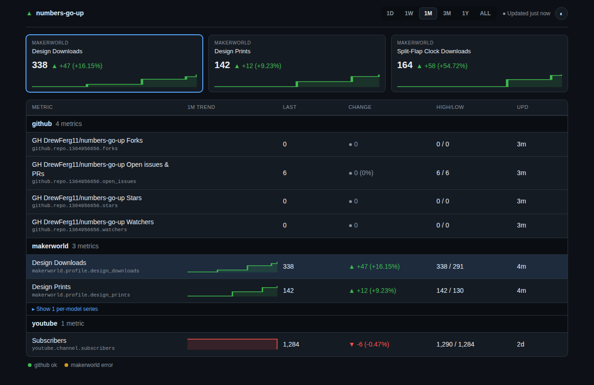

<p align="center">
  
</p>

<h1 align="center">numbers-go-up</h1>

<p align="center">
  <a href="https://github.com/DrewFerg11/numbers-go-up/releases/latest"></a>
  <a href="https://github.com/DrewFerg11/numbers-go-up/releases"></a>
  <a href="https://github.com/DrewFerg11/numbers-go-up/actions/workflows/ci-test.yml"></a>
  <a href="https://github.com/DrewFerg11/numbers-go-up/actions/workflows/ci-build.yml"></a>
  <a href="https://github.com/DrewFerg11/numbers-go-up/actions/workflows/codeql.yml"></a>
  <a href="https://github.com/DrewFerg11/numbers-go-up/actions/workflows/sources-canary.yml"></a>
</p>

<p align="center">
  <a href="https://github.com/DrewFerg11/numbers-go-up/commits/main"></a>
  <a href="./LICENSE"></a>
  
  <a href="https://hub.docker.com/r/drewferg11/numbers-go-up"></a>
  <a href="https://hub.docker.com/r/drewferg11/numbers-go-up"></a>
  
</p>

---

Self-hosted, plugin-based tracking for the counters you care about, with
history, rate-of-change, a REST API, and Home Assistant integration.

Most sites show you a number today and no memory of what it was last month.
numbers-go-up runs on your own hardware, checks those numbers on a schedule,
and keeps the history so you can ask what changed, how fast, and since when.

[**Read the documentation**](https://drewferg11.github.io/numbers-go-up/)
· [Try the static demo](https://drewferg11.github.io/numbers-go-up/demo/)
· [View source status](https://drewferg11.github.io/numbers-go-up/status/)



## What you get

- **One container.** FastAPI, APScheduler, and SQLite. No time-series
  database, Grafana, or separate poller to operate.
- **A dashboard and REST API.** Browse every counter, its history, and its
  rate of change. The container also serves an offline-capable Swagger UI.
- **Small, meaningful history.** Samples are stored when values change, with
  a daily heartbeat so gaps remain meaningful.
- **Home Assistant support.** MQTT discovery creates sensors with the right
  `state_class` for long-term statistics; milestone webhooks can trigger
  automations.
- **An extension point.** A source is one Python file. Built-in plugins cover
  five services, and user plugins load from `./user-plugins`.
- **Your data stays yours.** History is a SQLite file on your disk.

## Sources

| Source | What it tracks | API |
|---|---|---|
| [MakerWorld](https://drewferg11.github.io/numbers-go-up/plugins/makerworld/) | Profile and optional per-model counters | Unofficial |
| [GitHub](https://drewferg11.github.io/numbers-go-up/plugins/github/) | Repository and release counters | Official |
| [YouTube](https://drewferg11.github.io/numbers-go-up/plugins/youtube/) | Channel and video counters | Official |
| [TikTok](https://drewferg11.github.io/numbers-go-up/plugins/tiktok/) | Profile and video counters | Unofficial |
| [Abacus](https://drewferg11.github.io/numbers-go-up/plugins/abacus/) | Public counters by namespace and name | Official |

Every plugin is **opt-in and inert by default**. A fresh installation has no
default account identifiers and makes zero platform requests until you enable
and configure a source. See the [plugin documentation](https://drewferg11.github.io/numbers-go-up/plugins/)
for the request, credential, failure, and stability details of each source.

## Quickstart

```sh
git clone https://github.com/DrewFerg11/numbers-go-up.git
cd numbers-go-up
mkdir -p data config user-plugins
docker compose pull && docker compose up -d
curl localhost:8080/health
```

Then open `http://localhost:8080`.

Before using real data, follow the [install guide](https://drewferg11.github.io/numbers-go-up/getting-started/install/).
It covers the bind mounts, file ownership, first-run behavior, and the
important requirement that `./data` live on local disk, not NFS or SMB. The
[configuration guide](https://drewferg11.github.io/numbers-go-up/getting-started/configuration/)
explains every setting and environment variable.

## Documentation

- [Install](https://drewferg11.github.io/numbers-go-up/getting-started/install/)
  and [configuration](https://drewferg11.github.io/numbers-go-up/getting-started/configuration/)
- [Plugins and metric catalogue](https://drewferg11.github.io/numbers-go-up/plugins/)
- [Home Assistant](https://drewferg11.github.io/numbers-go-up/home-assistant/)
- [Operations](https://drewferg11.github.io/numbers-go-up/operations/)
  and [troubleshooting](https://drewferg11.github.io/numbers-go-up/troubleshooting/)
- [REST API reference](https://drewferg11.github.io/numbers-go-up/api/)
- [Writing a plugin](https://drewferg11.github.io/numbers-go-up/plugins/writing-a-plugin/)

For monitoring, point an uptime check at `/health/plugins`; it reports source
failures. `/health` only reports whether the process is running.

## Security and responsible use

The service deliberately has no authentication and is intended for a trusted
LAN. Use a VPN for remote access instead of exposing it to the internet. Read
[SECURITY.md](SECURITY.md) before reporting a vulnerability.

Plugins read public data about accounts you control. They do not use passwords,
session cookies, or private account data. Each source is polled conservatively
and backs off when asked to slow down. MakerWorld and TikTok use unofficial
public endpoints and can break when those sites change; GitHub, YouTube, and
Abacus use documented APIs. See [NOTICE.md](NOTICE.md) for the full responsible
use statement.

## Contributing

Read [CONTRIBUTING.md](CONTRIBUTING.md) for the plugin contract, offline-test
requirement, project decisions, and licensing rules. If a source stopped
working, use the **Broken data source** issue template; for application bugs,
use the bug template.

## Project status and license

The application is usable and includes the dashboard, five built-in plugins,
REST API, Home Assistant integration, milestone alerts, scheduled maintenance,
backups, and multi-architecture images. A `v1.0.0` release has not been tagged;
remaining work is tracked in [GitHub issues](https://github.com/DrewFerg11/numbers-go-up/issues).

Licensed under the [MIT License](LICENSE).
